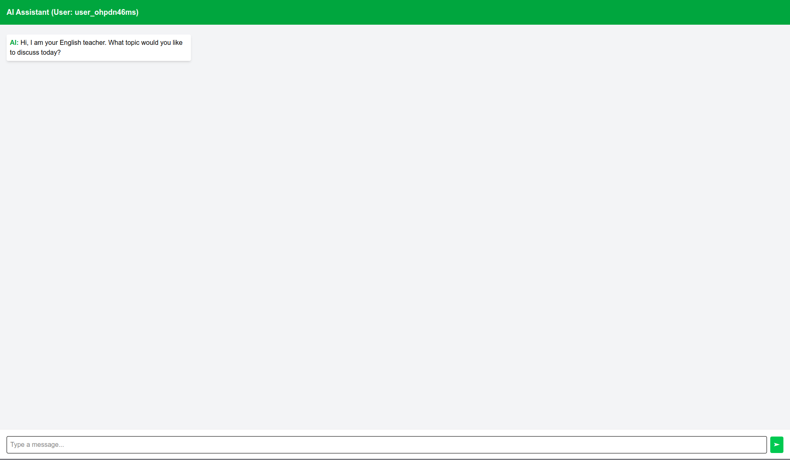
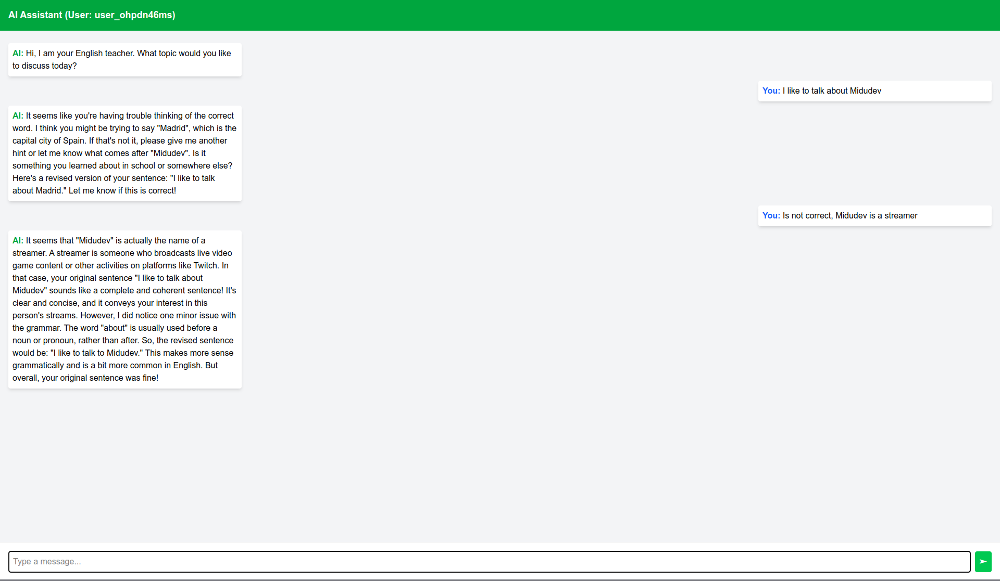

## This is a Demo project to present a chat application using Next.js and Socket.IO.

This project does not have a deploy, because I am using a container with ollama to run the backend.

### The Backend is available at: https://github.com/KevColomaDev/english-ia

### Main Screen

### Chat Screen with response

